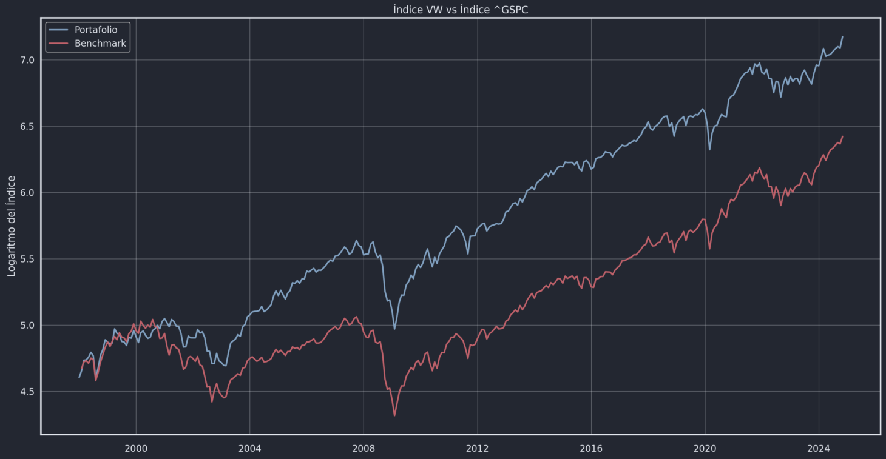
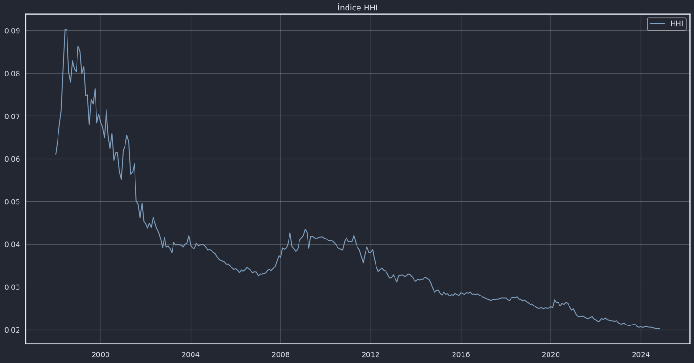
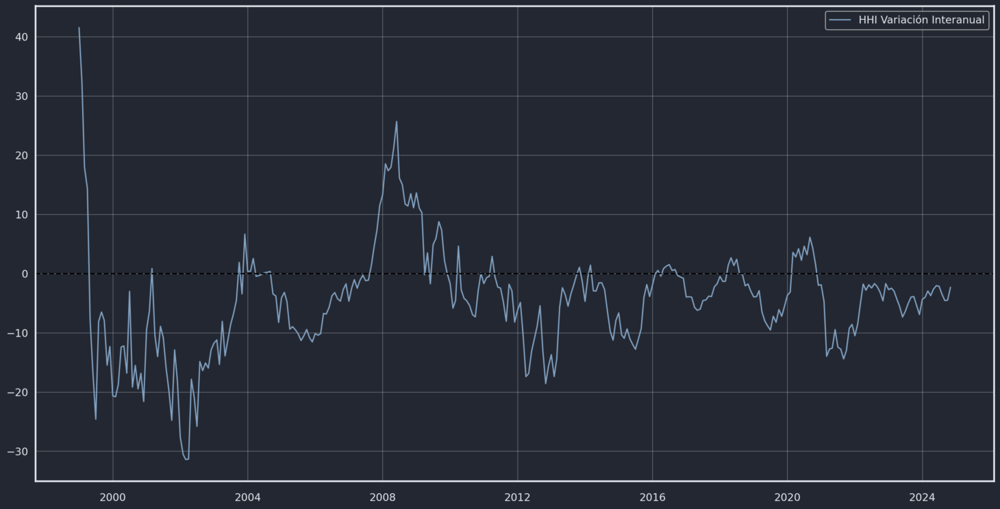
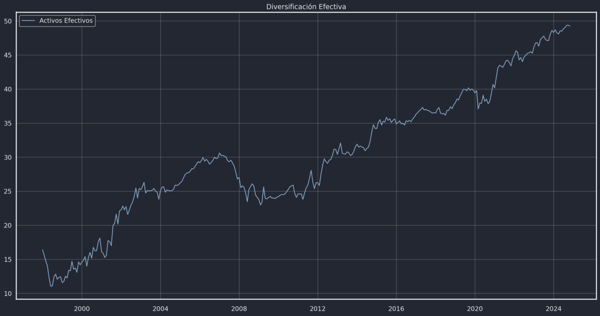
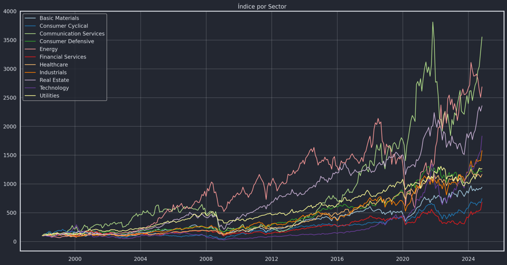
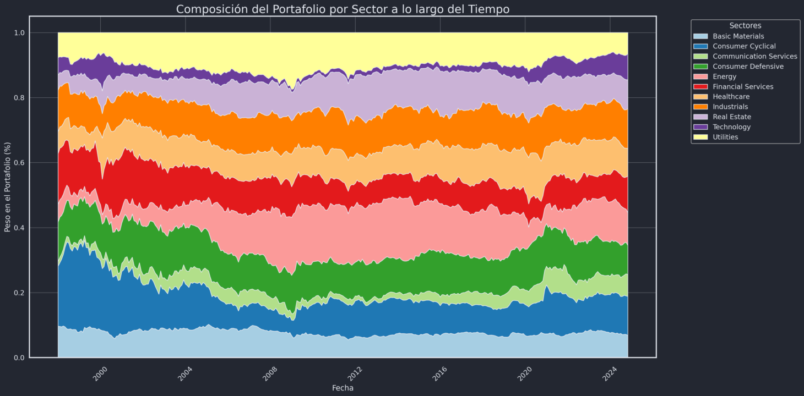
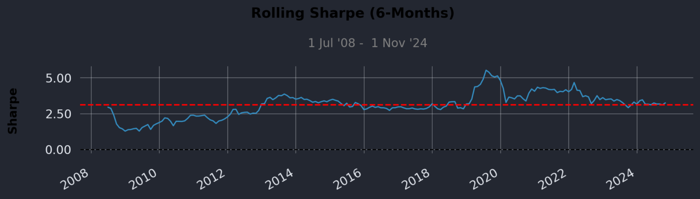
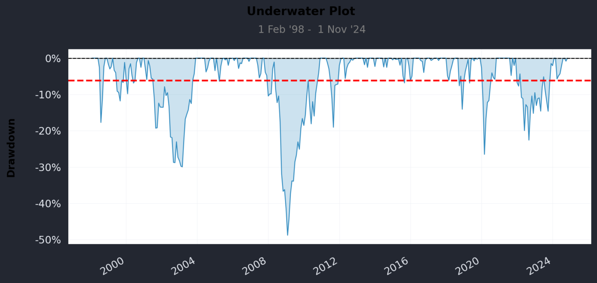
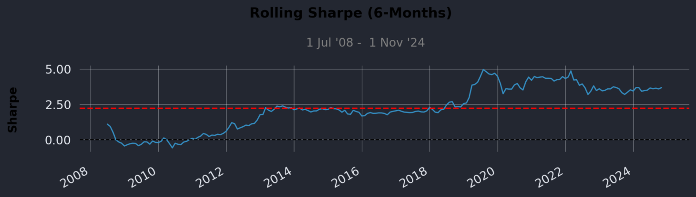
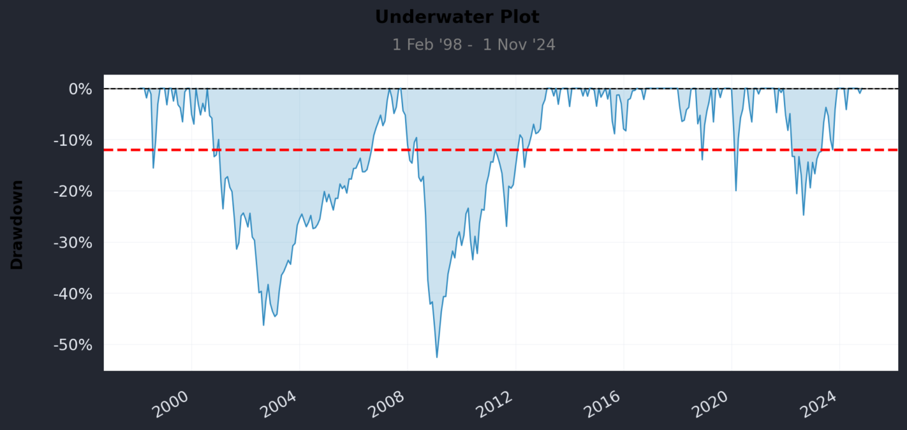

# Construcción y Análisis

Para este análisis se utilizaron precios ajustados de Yahoo Finance correspondientes a los siguientes tickers:  

**CTVA, VMC, DD, NUE, PPG, DASH, RBLX, EA, LYV, TKO, CMG, ROST, F, YUM, EBAY, MNST, KMB, KR, TGT, SYY, EOG, MPC, PSX, OXY, VLO, PNC, COIN, BK, TRV, HOOD, COR, BDX, EW, CAH, A, EMR, CSX, FDX, URI, CMI, SPG, PSA, CCI, AVB, IRM, MSI, NET, FICO, TTD, HUBS, D, EXC, ED, NRG, AWK**  

Se utilizó el **S&P 500 (^GSPC)** como benchmark de referencia.

El análisis comprende desde 01/1998 - 12/2024
---

## Índice VW vs Benchmark

En primer lugar, se calcula la **capitalización de mercado (MVE)** de cada empresa \(j\) en el período \(t\):

$$
MVE_{jt} = P_{jt} \cdot N_j
$$

donde:  
- $MVE_{jt}$ representa la capitalización de mercado de la empresa j en el período t.  
- $P_{jt}$ es el precio ajustado de la acción j en el período t.  
- $N_j$ es la cantidad de acciones en circulación.

Seguidamente, se calcula el **peso de cada empresa** en el índice ponderado por capitalización de mercado:

$$
w_{t-1} = \frac{MVE_{jt}}{\sum_{j=1}^{M_{t-1}} MVE_{jt}}
$$

Con base en estas ponderaciones, se calculan los **retornos del mercado**:

$$
r_{mt} = \sum_{j=1}^{M_{t-1}} w_{t-1} \, r_{jt}
$$

Finalmente, el **índice value-weighted (VW)** se calcula como el producto acumulado de los retornos del mercado:

$$
vw_t = \kappa \prod_{\tau=1}^{t} (1 + r_{m\tau})
$$

 Al analizar el comportamiento del índice S&P 500 frente al índice propio, se observa que ambos presentan una tendencia creciente similar. Sin embargo, el índice propio parece ser más vulnerable a shocks económicos y a presentar un mayor crecimiento. Esta diferencia se explica, en parte, por la composición de cada uno: el S&P 500 incluye las 500 empresas de mayor capitalización bursátil en EE. UU., mientras que el índice propio incorpora empresas de los 11 sectores económicos, incluyendo algunas que el S&P 500 considera demasiado pequeñas pero con altos rendimientos.

 ### Posibles sesgos del portafolio y del benchmark:
- Sesgo de supervivencia: El S&P solo muestra empresas que sobreviven, sobreestimando el rendimiento histórico.

- Sesgo de selección: Solo se incluyen empresas que cumplen ciertos criterios, dejando fuera muchas relevantes y limitando la diversidad del índice.

- Sesgo de capitalización: Las empresas más grandes pesan más, de modo que unos pocos movimientos dominan el índice y ocultan la dinámica real del índice.

---

 ## Índice Herfindahl-Hirschman
 
 El índice Herfindahl-Hirschman (HHI) es una medida utilizada para evaluar el nivel de concetración en un mercado, por tanto, permite estimar el grado de poder de mercado que tienen las empresas participantes. Se calcula sumando los cuadrados de las cuotas de mercado de cada empresa.

$$
HHI \equiv h = \sum_{i=1}^{n} w_i^2
$$

Esta figura muestra una tendencia decreciente en el índice Herfindahl-Hirschman (HHI), lo que evidencia una disminución progresiva en la concentración del mercado a lo largo del período analizado. Esto implica que el índice propio ha evolucionado hacia una estructura más equitativa, donde el peso ya no se concentra en unas pocas compañías dominantes. Este comportamiento sugiere un aumento en la diversidad y la competencia relativa dentro del índice, atribuible al ingreso paulatino de nuevas empresas. La expansión sectorial y la inclusión de firmas más pequeñas fortalecen su capacidad representativa del mercado en general.

 El análisis de la variación interanual afirma que, aunque la tendencia general del índice es hacia una menor concentración (como se ve en los niveles absolutos del HHI), existen momentos de reversión o choque en los que el poder de mercado se concentra temporalmente. Esto resalta la importancia de considerar tanto el nivel como la variación de la concentración al evaluar la representatividad y estabilidad del índice

 

Por otro lado, resulta interesante que, hacia el final del período, la cantidad efectiva de compañías es 49.25 y un h= 0.0203, pese a que el índice incluye 55 en total. Esto indica que al menos seis empresas tienen una participación tan baja que su peso relativo en el índice es prácticamente nulo, lo cual refleja cierto grado de concentración residual, aunque en niveles bajos. Recordando que el número efetivo de activos es $n^{\star} = \frac{1}{h}$

## Índices sectoriales
 Para construir el índice sectorial correspondiente a cada rama de actividad económica, se lleva a cabo un proceso en dos etapas. En primer lugar, se determina el peso relativo de cada empresa dentro de su sector, utilizando como criterio su capitalización de mercado. Este cálculo permite asignar mayor influencia en el índice a las compañías más grandes, reflejando con mayor precisión su participación real en el sector. Una vez definidos estos ponderadores, se procede al cálculo del rendimiento del sector. Para ello, se toma el rendimiento individual de cada empresa y se calcula un promedio ponderado, donde los pesos corresponden a las participaciones previamente determinadas. El resultado final es un indicador que resume el comportamiento agregado del sector durante el período de análisis, capturando tanto el efecto del desempeño de las empresas como su tamaño relativo.

 

Se observa la evolución diferenciada de los sectores económicos desde 1998, destacando el fuerte crecimiento del sector Energy frente al comportamiento más moderado de otros como Financial Servies. Esta divergencia refleja la transformación estructural del mercado estadounidense y refuerza la utilidad de un análisis sectorial para captar dinámicas específicas que podrían diluirse en un índice agregado

 

Este gráfico muestra cómo ha evolucionado la composición sectorial del portafolio.
 Un patrón notable es el crecimiento significativo del sector Tecnología, especialmente a partir de 2010, tomando más participación en años recientes. Por el contrario, el sector  Materiales Básicos (azul claro) ha mantenido una participación más estabñe y Energía (rosado) ha disminuido su participación en años recientes.

 ## Quantstats
Para más información sobre QuantStats: https://github.com/ranaroussi/quantstats

  ### Portafolio VW
  

A lo largo del periodo, la relación de Sharpe se ha mantenido mayormente por encima de 2.50 (la línea roja discontinua), lo que sugiere que el portafolio ha generado un rendimiento superior por el riesgo asumido. Se puede observar que el valor tuvo un pico significativo alrededor de 2020, lo que indica un excelente desempeño en ese periodo, seguido de una estabilización posterior.

  
 Los periodos de mayor inmersión, que representan las mayores pérdidas, ocurrieron durante el estallido de la burbuja "punto-com" a principios de los 2000, y de manera más notable, durante la crisis financiera de 2008, donde las pérdidas alcanzaron casi un 50%. En años más recientes, se observan caídas significativas en 2020 y 2022, aunque de menor magnitud.

  ### Benchmark

Inicialmente, el índice de Sharpe tuvo un valor bajo, incluso negativo, durante la crisis financiera de 2008-2009. Sin embargo, a partir de 2012, se recuperó y se ha mantenido mayormente por encima del valor de 2.50, lo que sugiere un rendimiento sólido en relación con el riesgo. Un punto notable es el pico significativo que se observa a finales de 2019 y principios de 2020, indicando un periodo de rendimiento excepcionalmente alto por el riesgo asumido, antes de estabilizarse en años más recientes.

  
 La caída más profunda ocurrió durante la crisis de 2008, donde las pérdidas casi alcanzaron el 50%. El gráfico muestra la vulnerabilidad de la cartera a eventos extremos del mercado.

 ### Razón de Sharpe Simple
 Para el portafolio se obtiene una razón de sharpe de 3.083 y para el S&P 500 de 2.364.
 Este resultado resalta los beneficios de la diversificación, ya que el índice value weighted incluye empresas de diversos tamaños y sectores. En consecuencia, se posiciona como la opción más eficiente en términos de rentabilidad ajustada por riesgo

 ## Frontera Eficiente

 